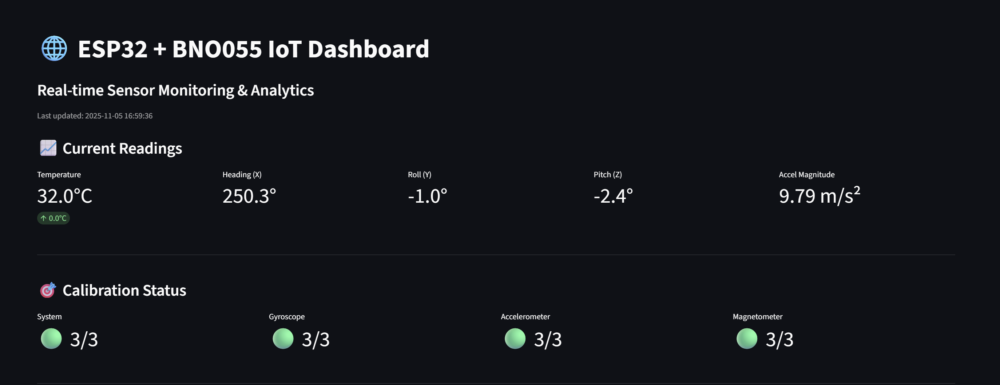

# esp32-iot-dashboard
This project connects an ESP32 microcontroller with the BNO055 IMU sensor to stream real-time orientation, acceleration, and temperature data to a Supabase database. The data is then visualized using an interactive Streamlit web dashboard, allowing for live monitoring, calibration insights, and safety alerts such as tilt warnings when roll or pitch exceeds ±45°.

The dashboard offers multiple visualization tabs — Orientation, Acceleration, Gyroscope, and Magnetometer — built with Plotly for smooth, responsive charts. It includes automatic data refresh, calibration status indicators, and downloadable CSV exports. The data pipeline is efficient, using Supabase’s REST API and caching for low-latency updates (0.5 s refresh rate).

